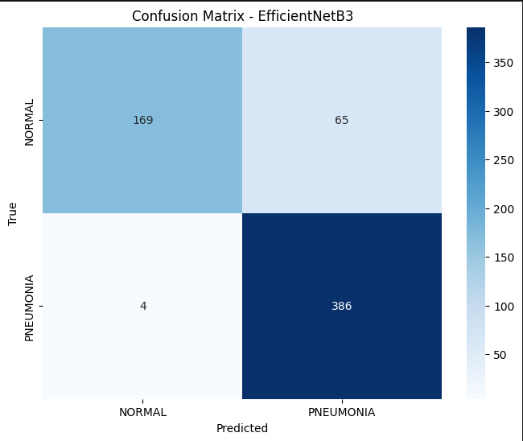
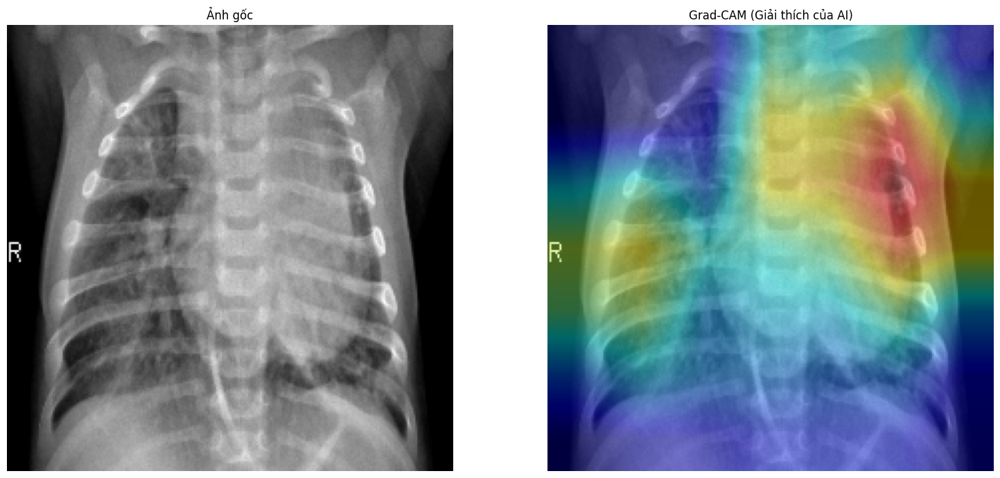

# 🧠 Phân loại Viêm phổi qua ảnh X-Ray (AI Explainable Web App)

## 🎯 Giới thiệu

Dự án **Phân loại viêm phổi từ ảnh X-Ray** ứng dụng **Deep Learning (TensorFlow/Keras)** và **AI Explainability (Grad-CAM)** nhằm hỗ trợ chẩn đoán bệnh viêm phổi qua ảnh X-quang ngực.
Hệ thống cho phép người dùng **tải ảnh X-ray**, mô hình sẽ **phân tích và hiển thị vùng nghi ngờ**, đồng thời trả về kết quả **PNEUMONIA / NORMAL**.

- 🧩 **Backend:** FastAPI (Python)
- 🌐 **Frontend:** ReactJS
- ⚙️ **Mô hình:** CNN (ResNet50, DenseNet121, EfficientB3)
- 📊 **Dataset:** [Chest X-Ray Images (Pneumonia)](https://www.kaggle.com/datasets/ghost5612/chest-x-ray-images-normal-and-pneumonia)

---

## 🧮 Kaggle Notebooks

> 💻 Các notebook chính được thực hiện và chia sẻ công khai trên Kaggle:

- [](https://www.kaggle.com/code/phongnguyen1337/n-m-n-khai-ph-d-li-u#Load-data) – **Phong Nguyen:** Tiền xử lý, huấn luyện và đánh giá mô hình phân loại viêm phổi.
- [](https://www.kaggle.com/code/traanfddinhfkhair/grad-cam) – **Khải Trần:** Giải thích mô hình bằng Grad-CAM và trực quan hóa vùng phổi tổn thương.

---

## 🏗️ Kiến trúc hệ thống

```
┌────────────────────────────┐
│      React Frontend        │
│ - Upload ảnh X-ray         │
│ - Gửi request đến API      │
│ - Hiển thị kết quả & GradCAM│
└────────────┬───────────────┘
             │
             ▼
┌────────────────────────────┐
│        FastAPI Backend     │
│ - Nhận ảnh từ frontend     │
│ - Tiền xử lý và dự đoán    │
│ - Trả JSON + ảnh GradCAM   │
└────────────┬───────────────┘
             │
             ▼
┌────────────────────────────┐
│         Model .keras        │
│ - Huấn luyện bằng TensorFlow│
│ - Lưu tại ./models/         │
└────────────────────────────┘
```

---

## 📦 Cấu trúc thư mục

```
Xray-Pneumonia-Classification/
├── backend/
│   ├── app.py
│   ├── start.bat
│   ├── fix.py
│
│
├── client/
│   ├── src/
│   │   ├── App.js
│   │   ├── components/
│   │   └── services/api.js
│   └── package.json
│
├── results/
│   ├── confusion_matrix.png
│   ├── gradcam_example.png
│   ├── metrics.csv
│   └── 2025-10-28 19-28-48.mkv
│
├── requirements.txt
├── LICENSE
|
└── README.md
```

---

## ⚙️ Cài đặt Backend

### 1️⃣ Tạo môi trường ảo

```bash
python -m venv venv
venv\Scripts\activate     # (Windows)
# hoặc
source venv/bin/activate  # (Linux/macOS)
```

### 2️⃣ Cài dependencies

```bash
pip install -r requirements.txt
```

### 3️⃣ Khởi chạy backend

```bash
cd backend
uvicorn app:app --host 0.0.0.0 --port 5000 --reload
```

API chạy tại: **[http://localhost:5000/predict](http://localhost:5000/predict)**

---

## 💻 Cài đặt Frontend

### 1️⃣ Cài thư viện

```bash
cd client
npm install
```

### 2️⃣ Cấu hình API trong React

Trong file `src/App.js` hoặc `src/services/api.js`:

```js
const API_URL = "http://localhost:5000/predict";
```

### 3️⃣ Chạy React App

```bash
npm start
```

Ứng dụng chạy tại: **[http://localhost:3000](http://localhost:3000)**

---

## 📤 Gửi ảnh để dự đoán

### Qua giao diện web:

- Nhấn **Chọn ảnh** → chọn file `.jpg` hoặc `.png`
- Nhấn **Phân tích**
- Xem kết quả dự đoán:

  - ✅ Nhãn: `PNEUMONIA` hoặc `NORMAL`
  - 📈 Độ tin cậy
  - 🔥 Ảnh Grad-CAM hiển thị vùng nghi ngờ

### Hoặc test bằng curl:

```bash
curl -X POST "http://localhost:5000/predict" -F "image=@/path/to/chest_xray.jpg"
```

---

## 📊 Kết quả huấn luyện

File `results/metrics.csv` lưu thông tin huấn luyện:

```csv
model_name,accuracy,precision,recall,f1_score,auc,val_loss,val_acc,epoch,time_stamp
ResNet50,0.937,0.945,0.975,0.960,0.982,0.197,0.937,25,2025-10-28 17:40:21
VGG16,0.910,0.926,0.950,0.938,0.975,0.225,0.910,30,2025-10-28 17:38:10
```

### Confusion Matrix



### Grad-CAM minh họa



---

## 🎥 Demo Web App

Dưới đây là quá trình phân tích ảnh X-ray và hiển thị Grad-CAM trên giao diện web:


👉 [Xem video chất lượng cao trên YouTube](https://www.youtube.com/watch?v=ZNc-g-88RRw)

---

## 🔮 Hướng phát triển

- Bổ sung dữ liệu có nhãn tuyến ức để giảm lỗi nhầm lẫn.
- Hợp tác với bác sĩ chuyên khoa nhi để đánh giá Grad-CAM.
- Nâng cấp web cho phép bác sĩ phản hồi và hiệu chỉnh vùng phát hiện.
- Triển khai Docker hoặc deploy trên cloud (Render, HuggingFace Space, v.v).

---

## 📄 Giấy phép

**MIT License**
Bản quyền © 2025 [metorkhai](https://github.com/metorkhai) & [PhongSEVN](https://github.com/PhongSEVN)

Xem chi tiết trong [LICENSE](LICENSE)

---

## 💬 Liên hệ

📧 [metorkhai@gmail.com](mailto:metorkhai@gmail.com)
🌐 GitHub: [metorkhai](https://github.com/metorkhai)
📁 Dự án: [Xray-Pneumonia-Classification](https://github.com/metorkhai/Xray-Pneumonia-Classification)
🤝 Đồng phát triển: [PhongSEVN](https://github.com/PhongSEVN/Xray-Pneumonia-Classification/fork)

---

## 🧩 Credits

- Dataset: Paul Mooney – Chest X-Ray Images (Pneumonia)
- Frameworks: TensorFlow, FastAPI, React
- Explainability: Grad-CAM
- Kaggle Notebooks:

  - [](https://www.kaggle.com/code/phongnguyen1337/n-m-n-khai-ph-d-li-u#Load-data)
  - [](https://www.kaggle.com/code/traanfddinhfkhair/grad-cam)
