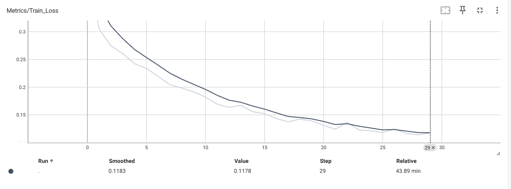
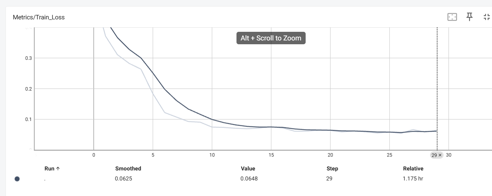
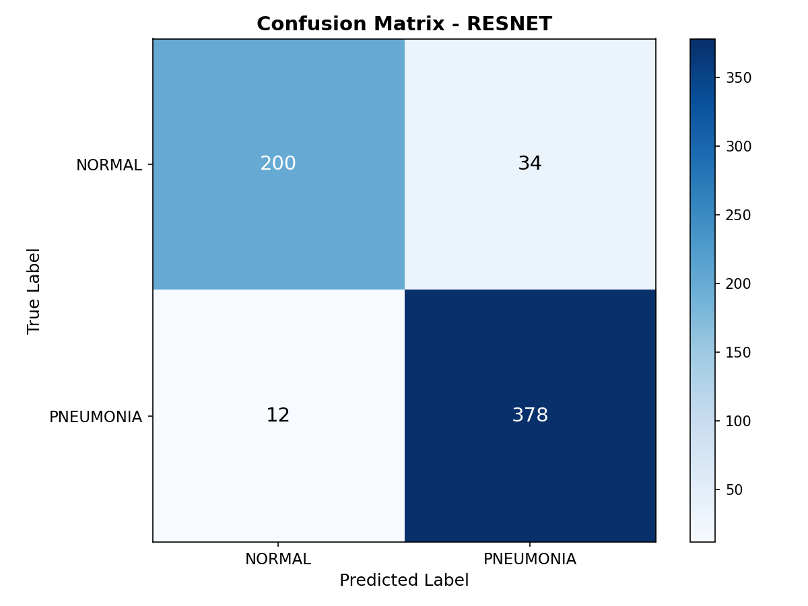

# Chest X-ray Classification

This project focuses on chest X-ray image classification using deep learning.  
Two approaches are implemented and compared:
1. A CNN trained from scratch
2. Transfer learning using pretrained models

The implementation is based on PyTorch and includes TensorBoard logging and model checkpointing.

---
## Dataset

Thanks ghost5612 on Kaggle for sharing:

- Link download: [Chest X-Ray Images (Pneumonia)](https://www.kaggle.com/datasets/ghost5612/chest-x-ray-images-normal-and-pneumonia)

Structure of dataset:
```text
chest_xray/
├── train/
│   ├── NORMAL/
│   └── PNEUMONIA/
├── test/
│   ├── NORMAL/
│   └── PNEUMONIA/
└── val/
    ├── NORMAL/
    └── PNEUMONIA/
```

---

## Results

### CNN from Scratch
- Best validation accuracy: **91.51%**
- Training on GPU (CUDA)




### Transfer Learning using Resnet
- Best validation accuracy: **92.63%** at epoch 11
- Training on GPU (CUDA)

  



I have done resnet but cant push on Github because the size file is to big (109MB)

---

## Features
- CNN model implemented in PyTorch
- Transfer learning support with pretrained models
- Data augmentation (RandomAffine, Resize)
- Class imbalance handling using weighted loss
- TensorBoard logging (loss, accuracy, confusion matrix)
- Model checkpointing (best and last)
- GPU and CPU supported

---

## Project Structure

```text
.
├── configs/
│   └── train_config.py      # Training hyperparameters
├── data/                    # Folder of dataset
├── dataset/
│   └── dataset.py           # Chest X-ray dataset loader
├── models/
│   ├── CNN_model.py         # CNN trained from scratch
│   └── resnet.py            # Transfer learning models
├── results/                 # Folder saves results
├── train.py                 # Training script for CNN
├── test.py                  # Script for test
├── train_transfer.py        # Training script for transfer learning
├── tensorboard/             # TensorBoard logs
├── trained_model/           # Saved checkpoints
└── README.md
```
